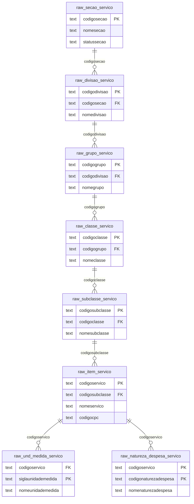
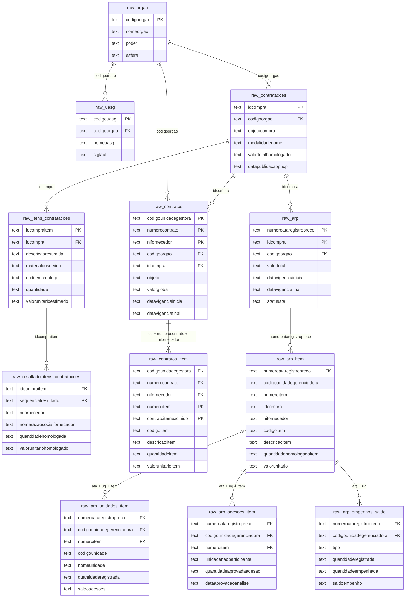

# Schema `compras_gov` — Documentação de Tabelas

Dados ingeridos da API pública **Dados Abertos Compras Gov.br** (`dadosabertos.compras.gov.br`).  
Todas as colunas são do tipo `text` — conversões de tipo (datas, números) devem ser feitas na camada analítica.  
Todas as tabelas possuem a coluna `dt_ingest` com o timestamp de quando o registro foi carregado.

---

## Resumo das tabelas

| Tabela | Registros | Domínio |
|---|---|---|
| `raw_caracteristicas_material` | 1.904.256 | Catálogo de Materiais |
| `raw_contratos_item` | 657.555 | Contratos |
| `raw_arp_item` | 383.772 | ARP |
| `raw_contratos` | 378.913 | Contratos |
| `raw_item_material` | 343.036 | Catálogo de Materiais |
| `raw_resultado_itens_contratacoes` | 332.987 | Contratações |
| `raw_itens_contratacoes` | 243.153 | Contratações |
| `raw_contratacoes` | 112.272 | Contratações |
| `raw_arp` | 65.483 | ARP |
| `raw_unidade_fornecimento_material` | 47.990 | Catálogo de Materiais |
| `raw_arp_unidades_item` | 33.441 | ARP |
| `raw_uasg` | 21.926 | Órgãos |
| `raw_pdm_material` | 20.415 | Catálogo de Materiais |
| `raw_orgao` | 11.820 | Órgãos |
| `raw_natureza_despesa_servico` | 7.441 | Catálogo de Serviços |
| `raw_und_medida_servico` | 3.428 | Catálogo de Serviços |
| `raw_arp_adesoes_item` | 3.389 | ARP |
| `raw_item_servico` | 2.961 | Catálogo de Serviços |
| `raw_natureza_despesa_material` | 1.574 | Catálogo de Materiais |
| `raw_classe_material` | 711 | Catálogo de Materiais |
| `raw_classe_servico` | 313 | Catálogo de Serviços |
| `raw_arp_empenhos_saldo` | 298 | ARP |
| `raw_subclasse_servico` | 281 | Catálogo de Serviços |
| `raw_grupo_servico` | 148 | Catálogo de Serviços |
| `raw_grupo_material` | 79 | Catálogo de Materiais |
| `raw_divisao_servico` | 40 | Catálogo de Serviços |
| `raw_secao_servico` | 6 | Catálogo de Serviços |
| `checkpoint_contratos` | 42.534 | Controle interno |

---

## Diagrama de relacionamentos

### Domínio: Catálogo de Materiais

```mermaid
erDiagram
    raw_grupo_material {
        text codigogrupo PK
        text nomegrupo
        text statusgrupo
    }
    raw_classe_material {
        text codigoclasse PK
        text codigogrupo FK
        text nomeclasse
        text statusclasse
    }
    raw_pdm_material {
        text codigopdm PK
        text codigoclasse FK
        text nomepdm
        text statuspdm
    }
    raw_item_material {
        text codigoitem PK
        text codigopdm FK
        text descricaoitem
        text statusitem
        text codigo_ncm
    }
    raw_caracteristicas_material {
        text codigoitem FK
        text codigocaracteristica
        text nomecaracteristica
        text codigovalorcaracteristica
        text nomevalorcaracteristica
    }
    raw_unidade_fornecimento_material {
        text codigopdm FK
        text siglaunidadefornecimento
        text nomeunidadefornecimento
    }
    raw_natureza_despesa_material {
        text codigopdm FK
        text codigonaturezadespesa
        text nomenaturezadespesa
    }

    raw_grupo_material ||--o{ raw_classe_material : "codigogrupo"
    raw_classe_material ||--o{ raw_pdm_material : "codigoclasse"
    raw_pdm_material ||--o{ raw_item_material : "codigopdm"
    raw_item_material ||--o{ raw_caracteristicas_material : "codigoitem"
    raw_pdm_material ||--o{ raw_unidade_fornecimento_material : "codigopdm"
    raw_pdm_material ||--o{ raw_natureza_despesa_material : "codigopdm"
```



### Domínio: Catálogo de Serviços



### Domínio: Órgãos, Contratações, Contratos e ARP



---

## Domínio 1: Catálogo de Materiais

Hierarquia: **Grupo → Classe → PDM (Padrão Descritivo de Material) → Item**

### `raw_grupo_material`
Nível raiz da hierarquia de materiais.

| Coluna | Descrição |
|---|---|
| `codigogrupo` **PK** | Código identificador do grupo |
| `nomegrupo` | Nome do grupo |
| `statusgrupo` | Ativo/inativo |
| `datahoraatualizacao` | Última atualização na API |

### `raw_classe_material`
Subdivisão de grupos.

| Coluna | Descrição |
|---|---|
| `codigoclasse` **PK** | Código identificador da classe |
| `codigogrupo` **FK** → `raw_grupo_material` | Grupo pai |
| `nomeclasse` | Nome da classe |
| `statusclasse` | Ativo/inativo |

### `raw_pdm_material`
Padrão Descritivo de Material — agrupamento de itens com características similares.

| Coluna | Descrição |
|---|---|
| `codigopdm` **PK** | Código do PDM |
| `codigoclasse` **FK** → `raw_classe_material` | Classe pai |
| `nomepdm` | Nome do PDM |
| `statuspdm` | Ativo/inativo |

### `raw_item_material`
Itens individuais do catálogo de materiais (343 mil itens).

| Coluna | Descrição |
|---|---|
| `codigoitem` **PK** | Código do item no catálogo |
| `codigopdm` **FK** → `raw_pdm_material` | PDM pai |
| `descricaoitem` | Descrição completa do item |
| `statusitem` | Ativo/inativo |
| `itemsustentavel` | Indicador de sustentabilidade |
| `codigo_ncm` | Código NCM (Nomenclatura Comum do Mercosul) |
| `descricao_ncm` | Descrição da classificação NCM |
| `aplica_margem_preferencia` | Aplica margem de preferência nacional |

### `raw_caracteristicas_material`
Características e valores possíveis para cada item (1,9M de linhas — maior tabela do schema).

| Coluna | Descrição |
|---|---|
| `codigoitem` **FK** → `raw_item_material` | Item ao qual a característica pertence |
| `codigocaracteristica` | Código da característica |
| `nomecaracteristica` | Ex: "Cor", "Material", "Capacidade" |
| `codigovalorcaracteristica` | Código do valor |
| `nomevalorcaracteristica` | Ex: "Azul", "Aço inox", "500ml" |
| `numerocaracteristica` | Número de ordem da característica no item |
| `siglaunidademedida` | Unidade de medida (quando aplicável) |
| `itemsustentavel` | Flag de item sustentável |

> **Nota:** Sem chave primária definida — a API retorna dados com campos-chave nulos ou duplicados.

### `raw_unidade_fornecimento_material`
Unidades de fornecimento aceitas por PDM (ex: "Caixa c/ 12 unidades").

| Coluna | Descrição |
|---|---|
| `codigopdm` **FK** → `raw_pdm_material` | PDM ao qual a unidade pertence |
| `siglaunidadefornecimento` | Sigla (ex: CX, PC, KG) |
| `nomeunidadefornecimento` | Nome completo |
| `descricaounidadefornecimento` | Descrição detalhada |
| `siglaunidademedida` | Unidade de medida base |
| `capacidadeunidadefornecimento` | Quantidade por unidade de fornecimento |

### `raw_natureza_despesa_material`
Naturezas de despesa orçamentária associadas a PDMs.

| Coluna | Descrição |
|---|---|
| `codigopdm` **FK** → `raw_pdm_material` | PDM ao qual a natureza pertence |
| `codigonaturezadespesa` | Código da natureza de despesa (ex: 33903000) |
| `nomenaturezadespesa` | Nome da natureza de despesa |

---

## Domínio 2: Catálogo de Serviços

Hierarquia: **Seção → Divisão → Grupo → Classe → Subclasse → Item**

### `raw_secao_servico`
Nível raiz — apenas 6 seções existentes.

| Coluna | Descrição |
|---|---|
| `codigosecao` **PK** | Código da seção |
| `nomesecao` | Nome da seção |
| `statussecao` | Ativo/inativo |

### `raw_divisao_servico`
| Coluna | Descrição |
|---|---|
| `codigodivisao` **PK** | Código da divisão |
| `codigosecao` **FK** → `raw_secao_servico` | Seção pai |
| `nomedivisao` | Nome da divisão |

### `raw_grupo_servico`
| Coluna | Descrição |
|---|---|
| `codigogrupo` **PK** | Código do grupo |
| `codigodivisao` **FK** → `raw_divisao_servico` | Divisão pai |
| `nomegrupo` | Nome do grupo |

### `raw_classe_servico`
| Coluna | Descrição |
|---|---|
| `codigoclasse` **PK** | Código da classe |
| `codigogrupo` **FK** → `raw_grupo_servico` | Grupo pai |
| `nomeclasse` | Nome da classe |

### `raw_subclasse_servico`
| Coluna | Descrição |
|---|---|
| `codigosubclasse` **PK** | Código da subclasse |
| `codigoclasse` **FK** → `raw_classe_servico` | Classe pai |
| `nomesubclasse` | Nome da subclasse |

### `raw_item_servico`
Itens individuais do catálogo de serviços (2.961 itens).

| Coluna | Descrição |
|---|---|
| `codigoservico` **PK** | Código do serviço |
| `codigosubclasse` **FK** → `raw_subclasse_servico` | Subclasse pai |
| `nomeservico` | Nome do serviço |
| `codigocpc` | Código CPC (Classificação Central de Produtos) |
| `exclusivocentralcompras` | Exclusivo para Central de Compras |
| `statusservico` | Ativo/inativo |

### `raw_und_medida_servico`
Unidades de medida por serviço.

| Coluna | Descrição |
|---|---|
| `codigoservico` **PK/FK** → `raw_item_servico` | Código do serviço |
| `siglaunidademedida` **PK** | Sigla (ex: HH, M2, UN) |
| `nomeunidademedida` | Nome da unidade |

### `raw_natureza_despesa_servico`
| Coluna | Descrição |
|---|---|
| `codigoservico` **PK/FK** → `raw_item_servico` | Código do serviço |
| `codigonaturezadespesa` **PK** | Código da natureza de despesa |
| `nomenaturezadespesa` | Nome da natureza de despesa |

---

## Domínio 3: Órgãos e UASGs

### `raw_orgao`
Cadastro de órgãos da administração pública federal.

| Coluna | Descrição |
|---|---|
| `codigoorgao` **PK** | Código do órgão (SIORG) |
| `nomeorgao` | Nome do órgão |
| `nomemnemonicoorgao` | Nome abreviado (sigla) |
| `cnpjcpforgao` | CNPJ do órgão |
| `codigoorgaovinculado` | Código do órgão ao qual está vinculado |
| `codigoorgaosuperior` | Código do órgão superior hierárquico |
| `codigotipoadministracao` | Tipo de administração |
| `poder` | Executivo, Legislativo, Judiciário |
| `esfera` | Federal, Estadual, Municipal |
| `statusorgao` | Ativo/inativo |

### `raw_uasg`
Unidades Administrativas de Serviços Gerais — unidades compradoras dentro dos órgãos.

| Coluna | Descrição |
|---|---|
| `codigouasg` **PK** | Código da UASG (SIASG) |
| `codigoorgao` **FK** → `raw_orgao` | Órgão ao qual pertence |
| `nomeuasg` | Nome da unidade |
| `cnpjcpfuasg` | CNPJ da UASG |
| `siglauf` | Estado (UF) |
| `codigomunicipioibge` | Código IBGE do município |
| `nomemunicipioibge` | Nome do município |
| `statusuasg` | Ativo/inativo |

---

## Domínio 4: Contratações (Lei 14.133/2021)

Editais e processos de compra publicados no PNCP (Portal Nacional de Contratações Públicas).

### `raw_contratacoes`
Cabeçalho do processo de contratação (edital).

| Coluna | Descrição |
|---|---|
| `idcompra` **PK** | Identificador único da compra no PNCP |
| `codigoorgao` **FK** → `raw_orgao` | Órgão comprador |
| `numerocontrolepncp` | Número de controle no PNCP |
| `objetocompra` | Descrição do objeto da contratação |
| `modalidadenome` | Pregão Eletrônico, Concorrência, Dispensa, etc. |
| `srp` | Indica se é Sistema de Registro de Preços (origem de ARP) |
| `valortotalestimado` | Valor estimado da contratação |
| `valortotalhomologado` | Valor efetivamente homologado |
| `datapublicacaopncp` | Data de publicação no PNCP |
| `dataaberturapropostapncp` | Data de abertura das propostas |
| `situacaocompranomepncp` | Situação atual (em andamento, encerrada, etc.) |
| `contratacaoexcluida` | Flag de exclusão lógica |

### `raw_itens_contratacoes`
Itens individuais de cada processo de contratação.

| Coluna | Descrição |
|---|---|
| `idcompraitem` **PK** | Identificador do item na compra |
| `idcompra` **FK** → `raw_contratacoes` | Compra a que pertence |
| `descricaoresumida` | Descrição resumida do item |
| `descricaodetalhada` | Descrição detalhada |
| `materialouservico` | M (material) ou S (serviço) |
| `coditemcatalogo` | Código no catálogo de materiais/serviços *(join com `raw_item_material.codigoitem` ou `raw_item_servico.codigoservico`)* |
| `codigoclasse` / `codigogrupo` | Classificação no catálogo |
| `quantidade` | Quantidade licitada |
| `valorunitarioestimado` | Valor unitário estimado |
| `situacaocompraitemnome` | Situação do item |
| `temresultado` | Se há resultado homologado |

### `raw_resultado_itens_contratacoes`
Resultado de cada item — fornecedor vencedor e valor homologado.

| Coluna | Descrição |
|---|---|
| `idcompraitem` **PK/FK** → `raw_itens_contratacoes` | Item da contratação |
| `sequencialresultado` **PK** | Sequência do resultado (pode haver mais de um por item em SRP) |
| `nifornecedor` | CPF/CNPJ do fornecedor vencedor |
| `nomerazaosocialfornecedor` | Nome do fornecedor |
| `quantidadehomologada` | Quantidade efetivamente homologada |
| `valorunitariohomologado` | Valor unitário final |
| `valortotalhomologado` | Valor total homologado |
| `portefornecedornome` | Porte do fornecedor (ME, EPP, Grande Empresa) |
| `situacaocompraitemresultadonome` | Situação do resultado |

---

## Domínio 5: Contratos

Contratos formalizados após os processos de contratação.

### `raw_contratos`
Contratos assinados entre órgãos e fornecedores.

| Coluna | Descrição |
|---|---|
| `codigounidadegestora` **PK** | Código da unidade gestora (UASG executora) |
| `numerocontrato` **PK** | Número do contrato |
| `nifornecedor` **PK** | CPF/CNPJ do fornecedor contratado |
| `codigoorgao` **FK** → `raw_orgao` | Órgão contratante |
| `idcompra` **FK** → `raw_contratacoes` | Processo de contratação de origem |
| `objeto` | Objeto do contrato |
| `valorglobal` | Valor global do contrato |
| `numeroparcelas` | Número de parcelas |
| `valorparcela` | Valor de cada parcela |
| `valoracumulado` | Valor acumulado pago |
| `datavigenciainicial` | Início da vigência |
| `datavigenciafinal` | Fim da vigência |
| `nomerazaosocialfornecedor` | Nome do fornecedor |
| `contratoexcluido` | Flag de exclusão lógica |

### `raw_contratos_item`
Itens detalhados de cada contrato.

| Coluna | Descrição |
|---|---|
| `codigounidadegestora` **PK/FK** → `raw_contratos` | Unidade gestora |
| `numerocontrato` **PK/FK** → `raw_contratos` | Número do contrato |
| `nifornecedor` **PK/FK** → `raw_contratos` | Fornecedor |
| `numeroitem` **PK** | Número do item no contrato |
| `contratoitemexcluido` **PK** | Flag de exclusão (faz parte da PK por design da API) |
| `idcompra` **FK** → `raw_contratacoes` | Compra de origem |
| `codigoitem` | Código no catálogo *(join com `raw_item_material`)* |
| `descricaoiitem` | Descrição do item |
| `quantidadeitem` | Quantidade contratada |
| `valorunitarioitem` | Valor unitário |
| `valortotalitem` | Valor total do item |

---

## Domínio 6: ARP — Atas de Registro de Preços

Atas resultantes de licitações do tipo SRP (Sistema de Registro de Preços).

### `raw_arp`
Cabeçalho da ata de registro de preço.

| Coluna | Descrição |
|---|---|
| `numeroataregistropreco` **PK** | Número da ata |
| `idcompra` **PK/FK** → `raw_contratacoes` | Processo de contratação de origem |
| `codigoorgao` **FK** → `raw_orgao` | Órgão gerenciador |
| `codigounidadegerenciadora` | Código da UASG gerenciadora *(pode ser nulo — ver nota)* |
| `valortotal` | Valor total da ata |
| `datavigenciainicial` | Início da vigência |
| `datavigenciafinal` | Fim da vigência |
| `statusata` | Vigente, encerrada, etc. |
| `objeto` | Objeto da ata |
| `quantidadeitens` | Número de itens registrados |
| `ataexcluido` | Flag de exclusão lógica |

> **Nota:** `codigounidadegerenciadora` pode ser nulo. A chave composta usa `idcompra` como alternativa.

### `raw_arp_item`
Itens registrados em cada ata — um item por fornecedor habilitado.

| Coluna | Descrição |
|---|---|
| `numeroataregistropreco` **PK/FK** → `raw_arp` | Número da ata |
| `codigounidadegerenciadora` **PK** | UASG gerenciadora |
| `numeroitem` **PK** | Número do item na ata |
| `idcompra` **PK** | ID da compra de origem |
| `nifornecedor` **PK** | Fornecedor com preço registrado |
| `codigoitem` | Código do item no catálogo |
| `descricaoitem` | Descrição do item |
| `quantidadehomologadaitem` | Quantidade total registrada na ata |
| `valorunitario` | Preço unitário registrado |
| `valortotal` | Valor total registrado |
| `maximoadesao` | Quantidade máxima para adesão (carona) |
| `nomerazaosocialfornecedor` | Nome do fornecedor |
| `itemexcluido` | Flag de exclusão lógica |

> **Nota:** 13.553 registros (~3,5%) têm pelo menos um campo da PK nulo e foram descartados na ingestão.

### `raw_arp_unidades_item`
Unidades participantes da ata por item — saldo disponível para cada unidade.

| Coluna | Descrição |
|---|---|
| `numeroataregistropreco` **FK** → `raw_arp_item` | Número da ata |
| `codigounidadegerenciadora` **FK** | UASG gerenciadora |
| `numeroitem` **FK** | Item da ata |
| `codigounidade` | Código da unidade participante |
| `nomeunidade` | Nome da unidade |
| `tipounidade` | Gerenciadora ou Participante |
| `quantidaderegistrada` | Quantidade total registrada para a unidade |
| `saldoadesoes` | Saldo disponível para adesões (carona) |
| `saldoremanejamentoempenho` | Saldo disponível para empenho |
| `aceitaadesao` | Se aceita adesão de não participantes |

> **Nota:** Os campos `numeroataregistropreco`, `codigounidadegerenciadora` e `numeroitem` foram adicionados na ingestão a partir dos parâmetros da requisição — a API não os retorna no corpo da resposta.

### `raw_arp_adesoes_item`
Adesões ("caronas") aprovadas por item da ata.

| Coluna | Descrição |
|---|---|
| `numeroataregistropreco` **FK** → `raw_arp_item` | Número da ata |
| `codigounidadegerenciadora` **FK** | UASG gerenciadora |
| `numeroitem` **FK** | Item da ata |
| `unidadenaoparticipante` | Código da unidade que aderiu (carona) |
| `quantidadeaprovadaadesao` | Quantidade aprovada na adesão |
| `dataaprovacaoanalise` | Data de aprovação da adesão |

> **Nota:** Os campos de contexto da ata foram injetados na ingestão — a API não os retorna.

### `raw_arp_empenhos_saldo`
Saldo de empenhos por ata e unidade gerenciadora.

| Coluna | Descrição |
|---|---|
| `numeroataregistropreco` **FK** → `raw_arp` | Número da ata |
| `codigounidadegerenciadora` **FK** | UASG gerenciadora |
| `tipo` | Tipo de empenho |
| `quantidaderegistrada` | Quantidade total registrada |
| `quantidadeempenhada` | Quantidade já empenhada |
| `saldoempenho` | Saldo disponível para empenho |

> **Nota:** Os campos de contexto foram injetados na ingestão. A tabela tem apenas 298 registros pois o endpoint de empenhos é extremamente lento (~25s/requisição) e a ingestão está incompleta.

---

## Tabela de controle interno

### `checkpoint_contratos`
Controle de progresso da ingestão de contratos por órgão e período. Não contém dados de negócio.

| Coluna | Descrição |
|---|---|
| `ds` | Data de execução da DAG |
| `codigo_orgao` | Código do órgão processado |
| `data_inicio` | Data de início do período ingerido |
| `concluido_em` | Timestamp de conclusão da ingestão daquele órgão/período |

---

## Joins mais comuns

```sql
-- Itens de contratações com descrição do catálogo de materiais
SELECT ic.*, im.descricaoitem, im.codigo_ncm
FROM compras_gov.raw_itens_contratacoes ic
LEFT JOIN compras_gov.raw_item_material im ON im.codigoitem = ic.coditemcatalogo
WHERE ic.materialouservico = 'M';

-- Contratos com nome do órgão
SELECT c.*, o.nomeorgao, o.poder, o.esfera
FROM compras_gov.raw_contratos c
LEFT JOIN compras_gov.raw_orgao o ON o.codigoorgao = c.codigoorgao;

-- Itens da ARP com fornecedor e preço, filtrando vigentes
SELECT a.numeroataregistropreco, a.datavigenciainicial, a.datavigenciafinal,
       ai.numeroitem, ai.descricaoitem, ai.valorunitario, ai.nifornecedor, ai.nomerazaosocialfornecedor
FROM compras_gov.raw_arp a
JOIN compras_gov.raw_arp_item ai ON ai.numeroataregistropreco = a.numeroataregistropreco
WHERE a.statusata = 'Vigente';

-- Resultado de contratações com dados do processo
SELECT c.objetocompra, c.modalidadenome, ic.descricaoresumida,
       r.nomerazaosocialfornecedor, r.valorunitariohomologado, r.quantidadehomologada
FROM compras_gov.raw_contratacoes c
JOIN compras_gov.raw_itens_contratacoes ic ON ic.idcompra = c.idcompra
JOIN compras_gov.raw_resultado_itens_contratacoes r ON r.idcompraitem = ic.idcompraitem;
```
